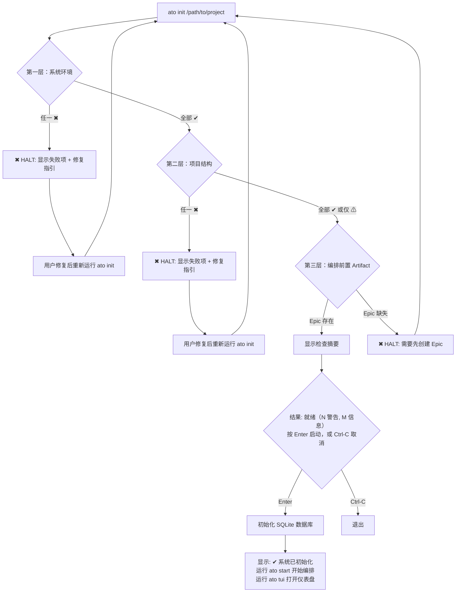
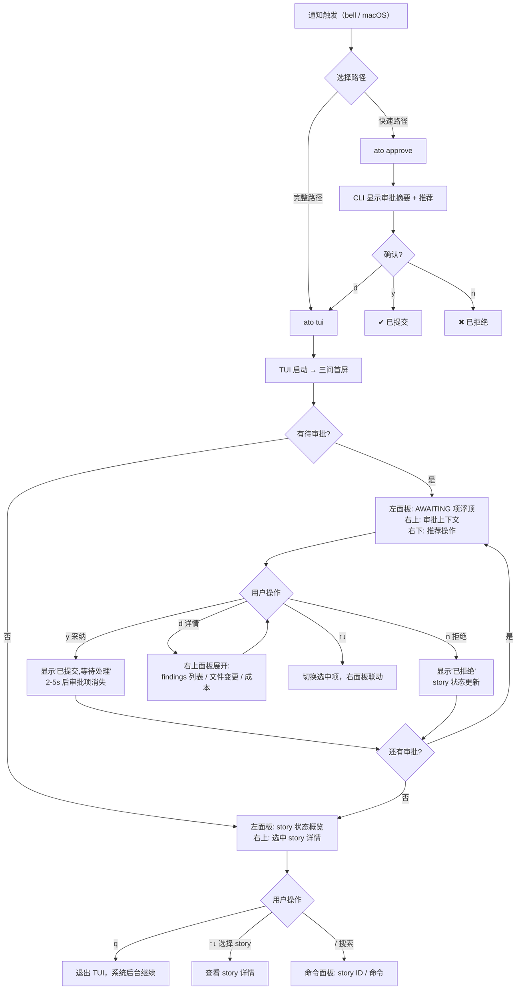
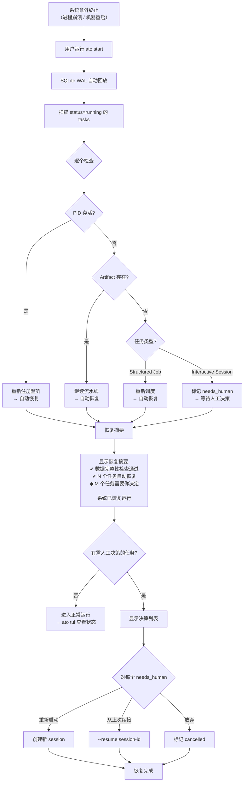
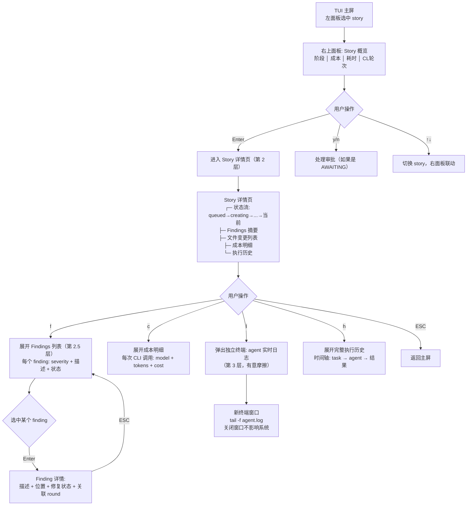
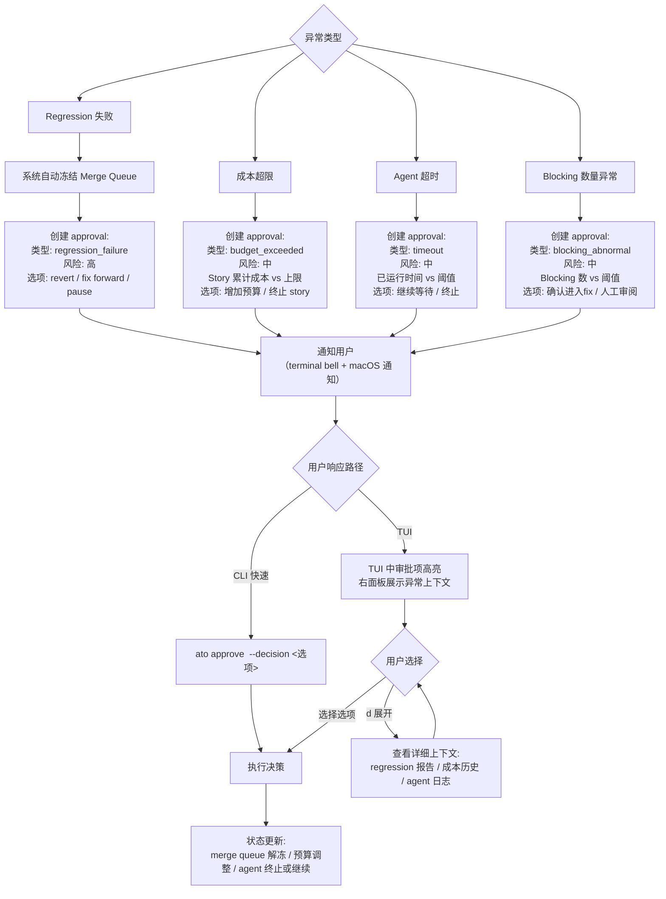

# UX Design Specification - AgentTeamOrchestrator

**Author:** Enjoyjavapan163.com
**Date:** 2026-03-24

---

<!-- UX design content will be appended sequentially through collaborative workflow steps -->

## Executive Summary

### Project Vision

AgentTeamOrchestrator 是一个本地运行的多角色 AI 团队编排系统。核心 UX 愿景是让技术负责人从"终端操作员"转变为"AI 团队指挥者"——系统自动推进流水线，人类只在关键节点做判断性决策。

交互模式的本质是**事件驱动的审批流**：系统后台持续运行，在需要人类判断时"浮出"决策请求，决策完成后系统继续自主推进。用户的理想工作节奏是"等待 → 判断 → 等待 → 判断"。

主要交互面是 TUI（终端用户界面）+ CLI 命令行，二者是**同一操作模型的两种渲染**——每个 TUI 操作有对应 CLI 命令，每个 CLI 命令的输出在 TUI 中有对应视图。

**核心 UX 原则：** 用户打开 TUI 时，系统回答三个问题——① 系统正常吗？② 需要我做什么？③ 钱花了多少？一切设计围绕这三个问题组织。

### Target Users

**主要用户：技术负责人（"李明"画像）**

- **角色：** 全栈技术负责人，同时维护多个项目
- **技术水平：** 极高——终端重度用户，精通 git、CLI 工具链、BMAD 方法论
- **核心痛点：** 手动编排多角色 AI 协作消耗大量带宽（70% 时间在监控而非判断）
- **期望转变：** 从"盯 agent 行为"到"处理审批队列"
- **设备与环境：** macOS 终端（iTerm2/Terminal.app），全天候运行，可能通过 SSH 远程访问
- **日常交互量：** 15-20 个审批决策/天，每个约 30 秒
- **终端条件多样性：** 宽屏本地终端（200+ 列）到窄 SSH 会话（80 列）都需要支持

**用户状态模型（影响 UX 决策）：**

| 状态 | 心理模式 | UX 需求 |
|------|---------|---------|
| 日常运营 | 从容、多任务切换 | 5 秒全局掌握 + 30 秒审批完毕 |
| 首次体验 | 好奇但谨慎 | 零配置上手 + 渐进复杂度 |
| 危机恢复 | 焦虑、需要安心 | 完整性确认信号 + 人话版恢复摘要 |
| 远程访问 | 匆忙、带宽有限 | 窄终端适配 + CLI 快速审批 |

### Key Design Challenges

1. **信息密度 vs 可读性** — 在终端有限空间内展示多项目 × 多 story × 多阶段状态，需清晰的信息层级（概览 → 详情 → 审计），首屏信息量控制在终端可见行数内
2. **审批交互的低摩擦** — 高频审批（15-20 次/天）要求"一句话摘要 + 推荐操作 + 风险指示器"三要素，90% 的审批应"看一眼就能决定"，防止长期使用后的审批疲劳
3. **状态机可理解性** — 新手不需要知道 15+ 种状态，只需三色信号灯（绿=正常、黄=等我、红=有问题）；高级用户可钻入查看完整状态流
4. **最终一致性透明化** — TUI 通过 SQLite 轮询（2-5 秒延迟），不能给用户"实时"的错觉，需要刷新时间戳和审批提交后的中间状态
5. **导航深度控制** — 任何信息的访问路径 ≤3 层，支持 `/` 搜索和 story ID 直达
6. **可访问性** — 色盲友好的多维信息编码（颜色 + Unicode 图标 + 文字 + 位置对齐）
7. **响应式终端布局** — 适配 80 列到 200+ 列的各种终端宽度

### Design Opportunities

1. **"零注意力成本"运行态** — 安静运行、按需打断。待审批项浮到首屏最顶部，无审批时显示状态概览
2. **三问首屏设计** — "系统正常吗？需要我做什么？花了多少？"替代传统仪表盘布局，直击用户核心关注
3. **审批快捷键 + CLI 快速路径** — TUI 中 `y`/`n`/`d` 一键操作，CLI 中 `ato approve <id>` 无需打开 TUI
4. **"人话版"崩溃恢复** — 恢复摘要用自然语言 + 完整性确认信号，消除焦虑
5. **活跃度心跳** — 长时间运行的任务显示经过时间和当前阶段进度，消除"是不是卡住了"的不确定感
6. **等宽字体优势** — 精确对齐的表格和列式布局，TUI 比 GUI 更适合信息密度高的状态展示
7. **多渠道通知** — MVP: Terminal bell（`\a` 转义序列）；Growth: macOS 系统通知（osascript/pync），确保紧急审批不被错过
8. **自包含通知** — 通知消息本身包含足够的决策信息和快捷命令

## Core User Experience

### Defining Experience

AgentTeamOrchestrator 的核心体验是**"指挥台"**——用户坐在一个信息高度浓缩的终端界面前，多条 AI 流水线在后台自主运行，用户只在关键节点做判断性决策。

**核心交互循环：**
1. **感知** — 打开 TUI，5 秒内掌握全局（三问首屏：正常吗？需要我？花了多少？）
2. **决策** — 处理审批队列，每个审批 30 秒内完成（一句话摘要 + 推荐 + 风险）
3. **观察** — 按需查看 agent 工作结果（story 详情页）；需要时在第 3 层入口弹出独立终端查看实时输出流
4. **回归** — 关掉 TUI，去做自己的创造性工作，等待下次通知

**最关键的单一交互：** "三问首屏"——用户打开 TUI 瞬间获得全局掌控感。首屏做对了，信息层级、导航结构、审批优先级等所有后续设计都有了锚点。

### Platform Strategy

| 维度 | 决策 |
|------|------|
| **平台** | 纯终端应用（TUI + CLI），无 Web/GUI |
| **操作系统** | macOS 优先，Linux 兼容 |
| **输入方式** | 键盘驱动，无鼠标/触控依赖 |
| **最小终端宽度** | 100 列（低于 100 列时显示降级警告并切换为 CLI-only 模式，信息密度不足以兑现 TUI "一眼可判"承诺） |
| **推荐终端宽度** | 140-200+ 列（本地开发的典型配置） |
| **TUI 框架** | Python Textual（与 Orchestrator 同语言） |
| **离线能力** | 完全本地运行，无网络依赖（agent CLI 调用除外） |
| **进程模型** | TUI 独立进程，通过 SQLite 直写 + nudge 通知（审批决策、UAT 结果、ato submit）；状态读取使用 2-5 秒轮询 |

**CLI/TUI 统一操作模型：** 每个 TUI 操作有对应 CLI 命令（如 `ato approve <id>`），每个 CLI 命令的输出在 TUI 中有对应视图。CLI 是 TUI 的无状态等价物，适合脚本自动化和远程快速操作。

**通知到决策的快速路径：** terminal bell 提醒 → `ato approve <id>` 一步到位，无需打开 TUI（Growth: macOS 系统通知实现一步跳转）。

### Effortless Interactions

**必须零摩擦的交互：**

| 交互 | 目标体验 | 实现方式 |
|------|---------|---------|
| 全局状态感知 | 打开 TUI 即知全局，无需任何操作 | 三问首屏自动渲染 |
| 常规审批 | 看一眼即可决定，单键完成 | `y` 采纳推荐 / `n` 拒绝 / `d` 展开详情 |
| 通知到决策 | 收到通知后一条命令完成审批 | macOS 通知 → `ato approve <id>` 直接搞定 |
| 查看 agent 结果 | story 详情页直接展示 findings 和文件变更 | agent 完成后结果入库，TUI 即时可查 |
| 查看 agent 实时输出 | 第 3 层入口一键弹出独立终端窗口 | story 详情页底部快捷键 → 新终端 tail 日志（有数秒写入延迟，非 zero-latency） |
| 崩溃恢复 | `ato start` 一条命令，系统自动恢复 | SQLite WAL + 人话版恢复摘要 + 完整性确认 |
| 首次上手 | `ato init` 零配置，自动检测环境 | 智能默认值 + 环境检测 + 引导式确认 |

**应该自动发生、无需用户干预的事情：**
- 流水线阶段自动推进（creating → validating → developing → reviewing → ...）
- Convergent Loop 自动执行 review-fix 循环并追踪收敛
- 崩溃后自动恢复可恢复的任务
- Merge queue 在 regression 失败时自动冻结
- 成本自动累计追踪

**有意摩擦的交互（防止旧习惯回归）：**
- Agent 实时输出流不在首屏或审批路径上，需要主动钻入 story 详情页才能触达——防止用户重新陷入"盯 agent 工作"的旧习惯

### Critical Success Moments

| 时刻 | 描述 | 成功标志 | 失败后果 |
|------|------|---------|---------|
| **首次 5 秒** | 用户首次打开 TUI | 立即理解界面布局和含义 | 困惑、关掉 TUI 去看 SQLite |
| **首个审批** | 第一次处理审批请求 | 上下文清晰、操作直觉、结果立即反馈 | 不确定该选什么，开始翻文档 |
| **首个端到端** | 第一个 story 从 creating 走到 done | 感受到自动化的价值——"我什么都没做它就完成了" | 中途卡住不知道为什么 |
| **首次收敛见证** | 第一次看到 Convergent Loop 自动收敛 | 用户亲眼看到 review→fix→re-review 自动闭合所有 blocking | 对系统的自动化质量产生怀疑 |
| **首次崩溃恢复** | 系统意外重启后 | 恢复摘要清晰、数据完好、2 分钟内回到正常 | 不确定有没有丢东西，开始手动检查 |
| **首次观察 agent** | 查看 agent 实时输出 | 一键弹窗、内容清晰、关掉不影响系统 | 找不到怎么看、或看到的信息没有意义 |
| **日常节奏建立** | 使用一周后 | 形成"通知→TUI→审批→关掉"的肌肉记忆 | 每次都要想"接下来该做什么" |

### Experience Principles

1. **审批优先，状态其次** — 待审批项永远是用户打开 TUI 时最先看到的内容。系统运行状态是背景信息，人类决策是前景任务。
2. **安静运行，按需打断** — 系统顺利运行时对用户零干扰。只在需要判断时才通过通知"浮出"，通知内容自包含足够的决策信息。
3. **一眼可判，一键可决** — 90% 的交互应该在 1 秒内完成。审批摘要精炼到"看一眼就知道该选什么"，快捷键直接执行。
4. **渐进复杂度** — 新手看到三色信号灯，老手可以钻入 15+ 种状态的完整流。任何信息 ≤3 层可达，不强制用户理解全部复杂度。
5. **透明而非实时** — 系统诚实地展示"这是 N 秒前的状态"，不假装实时。agent 执行细节按需可查（结果入库 + 独立终端实时流），但不强推到用户面前。
6. **崩溃不慌** — 恢复是一等公民体验。人话版摘要 + 完整性确认信号，让用户在最焦虑的时刻感到掌控。
7. **信任渐进建立** — 实时 stdout 查看是 MVP 阶段的信任过渡桥梁。系统主动展示可靠性证据（收敛率、成本趋势、UAT 缺陷下降），用户对实时监控的依赖随信任建立自然消退。

## Desired Emotional Response

### Primary Emotional Goals

**核心情感：指挥者式掌控感**

不是"所有事情都在我手里"的微管理式掌控，而是"我知道全局、系统值得信赖、我只在该出手时出手"的指挥者式掌控。类似经验丰富的主厨看着团队有条不紊地运作，偶尔走过去调整一道菜的调味。

**三层情感目标：**
1. **掌控** — 全局可感知、细节可触达、决策有选项
2. **信任** — 系统自动化质量可靠、质量门控有效、数据不会丢
3. **从容** — 审批快速无压力、通知不焦虑、节奏自己掌控

### Emotional Journey Mapping

| 阶段 | 期望情感 | 反面情感（需避免） | 设计保障 |
|------|---------|------------------|---------|
| 首次发现 | 好奇 + "这正是我需要的" | 怀疑（"又一个过度承诺的工具"） | 清晰的价值主张 + 真实场景展示 |
| 首次上手 | 轻松 + 安心（"比想象中简单"） | 不知所措（配置太复杂） | `ato init` 零配置 + 智能默认值 |
| 首个端到端 | 惊喜 + 信任萌芽（"它真的自己完成了"） | 怀疑（中途卡住不知为什么） | 状态流清晰可视 + 阶段转换通知 |
| 首次收敛见证 | 信服（"质量门控真的有效"） | 不信任（findings 看起来不靠谱） | findings 展示清晰 + severity 判定透明 |
| 日常审批循环 | 从容 + 高效（"30 秒搞定"） | 审批疲劳（"又来了"） | 推荐操作 + 一键完成 + 精炼摘要 |
| 系统自主运行 | 安心 + 信任（"它在好好干活"） | 焦虑（"是不是出问题了"） | 活跃度心跳 + 安静运行零打扰 |
| 出了问题 | 沉着 + 掌控（"我有选项"） | 恐慌（"丢了多少东西"） | 人话版恢复摘要 + 完整性确认 |
| 一天结束 | 成就 + 满足（"推进了这么多"） | 空虚（不知道今天干了什么） | 日进度摘要 + 成本报告 |
| 回头再用 | 期待 + 熟悉 | 抗拒（"又要去处理"） | 肌肉记忆友好的快捷键体系 |

### Micro-Emotions

**最关键的情感轴（按优先级）：**

1. **信任 vs 怀疑** — 最核心。用户必须信任系统的自动化质量，否则会回退到手动监控。信任通过可靠性证据（收敛率、UAT 趋势）渐进建立。
2. **掌控 vs 失控** — "能看但不必看"是掌控感的来源。用户随时能钻入查看细节，即使大多数时候不需要。
3. **成就 vs 挫败** — 一天结束时看到"10 个 story 推进了"应该带来满足感。系统要主动展示进度和成果。
4. **从容 vs 焦虑** — 审批通知应该是"邀请决策"而非"催促行动"。系统不急，用户不慌。

### Design Implications

| 情感目标 | UX 设计方式 | 具体实现 |
|---------|------------|---------|
| 掌控感 | 三问首屏 + 渐进披露 | ≤3 层可达任何信息 + `/` 搜索直达 |
| 信任感 | 可靠性证据展示 | 活跃度心跳 + 收敛率统计 + 完整性确认信号 |
| 从容感 | 低摩擦审批 | 推荐操作 + `y`/`n`/`d` 一键 + 不催促 |
| 安心感 | 透明恢复 | 人话版摘要 + "已提交，等待处理"中间状态 |
| 成就感 | 进度可视化 | 日/周进度摘要 + story 完成通知 + 成本节省展示 |
| 熟悉感 | 一致性 | CLI/TUI 统一操作模型 + 稳定的快捷键体系 |

**需要设计防御的负面情感：**

| 负面情感 | 触发场景 | 防御设计 |
|---------|---------|---------|
| 审批疲劳 | 长期高频审批 | 摘要精炼到"一眼可判" + 推荐操作减少认知负担 |
| 信息焦虑 | agent 细节暴露过多 | 实时输出放第 3 层，有意摩擦 |
| 失控恐慌 | 系统崩溃 | 完整性确认 + 恢复选项清晰 |
| 不确定感 | 长时间无状态变化 | 活跃度心跳（经过时间 + 当前进度） |
| 成本焦虑 | 不知道花了多少钱 | 三问首屏包含成本摘要 + story 级成本追踪 |

### Emotional Design Principles

1. **邀请而非催促** — 审批通知是"有个决策等你方便时处理"，不是"紧急！立即处理！"。唯一的例外是 regression 失败冻结 merge queue。
2. **证据建立信任** — 不要求用户盲信系统。通过展示收敛率、UAT 趋势、成本稳定性等数据，让信任在证据基础上自然建立。
3. **能看但不必看** — 每层细节都可触达，但系统不主动推送细节。用户选择自己的信息消费深度。
4. **庆祝进展** — 系统主动标记里程碑（story 完成、batch 交付、收敛率提升），让用户感受到成果在积累。
5. **失败不是末日** — 错误信息用"发生了什么 + 你的选项"格式，而非技术堆栈。语气沉着，传递"这是可处理的"信号。

## UX Pattern Analysis & Inspiration

### Inspiring Products Analysis

**Warp Terminal**

| 维度 | 分析 |
|------|------|
| 核心问题 | 传统终端是"无穷滚动的文字流"，缺乏结构化 |
| 关键创新 | Block 模式——每条命令和输出是离散的可交互块 |
| 导航设计 | ⌘K 命令面板，一个入口搜索所有操作 |
| AI 集成 | 辅助建议存在但不强推，用户主动触发 |
| 视觉设计 | 现代精致但不花哨，终端环境中依然清晰可读 |
| 用户留存 | 效率提升是核心驱动——用了就回不去传统终端 |

**Zsh（oh-my-zsh 生态）**

| 维度 | 分析 |
|------|------|
| 核心问题 | 默认 shell 信息匮乏、定制门槛高 |
| 关键创新 | 信息密集的 prompt——一行浓缩 git 状态、分支、目录、时间 |
| 交互模式 | Tab 补全 + 预览，输入即反馈、渐进式发现 |
| 上手体验 | 零配置默认值即可用，想定制时插件生态无限深入 |
| 视觉设计 | 颜色编码状态（git dirty/clean）、图标增强语义 |
| 用户留存 | 肌肉记忆一旦建立，快捷方式和别名成为不可替代的效率工具 |

**领域参考：lazygit / btop / GitHub Actions**

| 产品 | 可借鉴点 |
|------|---------|
| lazygit | 键盘导航极其高效、多面板布局清晰、快捷键一致且可发现 |
| btop | 实时刷新 + 高信息密度 + 颜色编码状态、响应式终端宽度适配 |
| GitHub Actions | 工作流阶段可视化、展开/折叠日志、成功/失败状态一目了然 |

### Transferable UX Patterns

**导航模式：**

| 模式 | 来源 | ATO 应用 |
|------|------|---------|
| 命令面板（⌘K / `/`） | Warp | TUI 中 `/` 键激活搜索，支持 story ID 直达、命令搜索、审批跳转 |
| 面板式布局 | lazygit | 首屏左侧项目/story 列表，右侧详情面板，底部审批队列 |
| Tab 切换视图 | btop | 不同 Tab 切换"状态概览/审批队列/成本面板"等视图 |

**交互模式：**

| 模式 | 来源 | ATO 应用 |
|------|------|---------|
| Block 化输出 | Warp | agent 执行结果作为离散块展示——findings 块、文件变更块、成本块，可独立选择和操作 |
| 信息密集单行 | zsh prompt | 每个 story 一行：状态图标 + ID + 阶段 + 进度 + 耗时 + 成本，浓缩到 100 列内 |
| 渐进披露 | zsh 补全 | 默认显示摘要，回车展开详情，再回车进入子页面 |
| 快捷键驱动 | lazygit | 所有操作有单键快捷键，底部 footer 显示当前可用操作 |

**视觉模式：**

| 模式 | 来源 | ATO 应用 |
|------|------|---------|
| 颜色编码状态 | zsh git status / btop | 三色信号灯（绿/黄/红）+ Unicode 图标双重编码 |
| 实时刷新 + 时间戳 | btop | 右上角显示"最后更新: Ns前"，状态变化时高亮闪烁 |
| 阶段进度条 | GitHub Actions | story 阶段用 `[████░░░░]` 风格的 ASCII 进度条 |
| 展开/折叠 | GitHub Actions | findings 列表默认折叠为计数，回车展开具体内容 |

### Anti-Patterns to Avoid

| 反模式 | 来源教训 | ATO 中如何避免 |
|--------|---------|---------------|
| 信息过载首屏 | 传统终端 CI 工具一次倾倒所有日志 | 三问首屏只回答三个问题，细节按需钻入 |
| 无结构的滚动流 | 传统终端 stdout | Block 化输出 + 离散可交互块 |
| 隐藏的快捷键 | 许多 TUI 工具快捷键无提示 | 底部 footer 始终显示当前上下文的可用操作（lazygit 模式） |
| 配置先于体验 | 需要先编辑 YAML 才能开始使用 | `ato init` 智能默认值，配置是可选的优化手段 |
| 模态困惑 | vim 式多模态让新手不知身在何处 | 始终显示当前位置（面包屑/高亮当前面板） |
| 错误信息是技术堆栈 | 传统 CLI 工具的 traceback | "发生了什么 + 你的选项"格式 |

### Design Inspiration Strategy

**直接采用：**

| 模式 | 理由 |
|------|------|
| 命令面板（`/` 搜索） | 支撑"≤3 层可达"和"story ID 直达"的核心承诺 |
| 底部 footer 快捷键提示 | 降低学习曲线，支撑"渐进复杂度"原则 |
| 颜色 + 图标双重编码 | 满足色盲友好 + 信息密集的双重需求 |
| 面板式布局 | 在单屏内同时展示列表和详情，减少导航跳转 |

**适配采用：**

| 模式 | 原始形态 | ATO 适配 |
|------|---------|---------|
| Warp Block | 命令+输出的块 | agent 结果块（findings/变更/成本各为独立块） |
| zsh prompt 密集信息 | 一行 shell 提示符 | 一行 story 状态摘要（100 列内浓缩全部关键信息） |
| btop 实时刷新 | 毫秒级系统监控 | 2-5 秒 SQLite 轮询 + "最后更新"时间戳（透明而非伪实时） |
| GitHub Actions 阶段图 | 线性阶段可视化 | story 状态流 + Convergent Loop 轮次进度 |

**明确避免：**

| 模式 | 理由 |
|------|------|
| 实时 stdout 流作为默认视图 | 与"零注意力成本"和"有意摩擦"原则冲突 |
| vim 式模态交互 | 目标用户虽然技术强，但 TUI 不应要求学习新的模态体系 |
| 强制配置向导 | 首次体验应该是"确认默认值"而非"填写配置" |

## Design System Foundation

### Design System Choice

**Textual 内置组件 + 轻量定制层**

基于 Python Textual 框架的标准 Widget 库，在此基础上构建少量 ATO 专属定制组件。通过 TCSS（Textual CSS）主题实现全局视觉一致性。

### Rationale for Selection

| 决策因素 | 分析 |
|---------|------|
| 单人开发 | 没有预算构建完整自定义设计系统，需要最大化复用框架内置能力 |
| 核心代码 ≤1500 行 | TUI 层应该尽量薄，设计系统不能成为代码膨胀来源 |
| MVP 快速交付 | Textual 标准组件开箱即用，无学习额外设计系统的成本 |
| 无品牌要求 | 功能优先，视觉一致性通过 TCSS 主题实现即可 |
| 终端环境约束 | Textual TCSS 是唯一可用的样式系统，没有 CSS 框架选择问题 |

### Implementation Approach

**直接使用的 Textual 标准组件：**

| 组件 | ATO 用途 |
|------|---------|
| `Header` | 顶栏：项目名 + 系统状态指示 + "最后更新: Ns前" |
| `Footer` | 底栏：当前上下文可用的快捷键提示（lazygit 模式） |
| `DataTable` | story 列表、findings 列表、成本表 |
| `Tree` | story 详情的嵌套信息（findings → 子项） |
| `Input` | `/` 搜索框、审批决策输入 |
| `Static` | 文本块展示（agent 结果、恢复摘要） |
| `TabbedContent` | Tab 切换视图（状态概览/审批队列/成本面板） |
| `ContentSwitcher` | 面板式布局的左右切换 |

**需要定制的 ATO 专属组件（≤5 个）：**

| 定制组件 | 功能 | 灵感来源 |
|---------|------|---------|
| `StoryStatusLine` | 一行浓缩 story 全部关键信息：状态图标 + ID + 阶段 + 进度条 + 耗时 + 成本 | zsh prompt |
| `ApprovalCard` | 审批项紧凑展示：类型图标 + story ID + 一句话摘要 + 推荐操作 + 风险指示 | Warp Block |
| `HeartbeatIndicator` | 活跃度心跳：运行中任务的经过时间 + 动态 spinner | btop |
| `ThreeQuestionHeader` | 三问首屏顶部摘要栏：系统状态 / 待审批数 / 今日成本 | 自创 |
| `ConvergentLoopProgress` | Convergent Loop 轮次进度：当前轮 / 最大轮 + open findings 数 | GitHub Actions |

### Customization Strategy

**TCSS 主题定义：**

```css
/* ATO 全局主题 — 三色信号灯 + 状态编码 */
$success: green;          /* 正常运行、已完成、已通过 */
$warning: yellow;         /* 等待人类决策、超时警告 */
$error: red;              /* 失败、blocked、冻结 */
$info: cyan;              /* 进行中、信息提示 */
$muted: grey;             /* 次要信息、已归档 */
```

**信息编码三重保障（色盲友好）：**

| 状态 | 颜色 | Unicode 图标 | 文字标签 |
|------|------|-------------|---------|
| 正常运行 | 绿色 | `●` | running |
| 等待人类 | 黄色 | `◆` | awaiting |
| 出了问题 | 红色 | `✖` | failed |
| 进行中 | 青色 | `◐` (动态) | active |
| 已完成 | 绿色 | `✔` | done |
| 已冻结 | 红色 | `⏸` | frozen |

**响应式布局策略：**

| 终端宽度 | 布局模式 | 信息调整 |
|---------|---------|---------|
| 100-139 列 | 单栏列表 | story 行精简（省略成本列） |
| 140-179 列 | 列表 + 窄详情面板 | 完整 story 行 + 基本详情 |
| 180+ 列 | 列表 + 宽详情面板 | 完整信息 + findings 预览 |

## Defining Core Experience

### Defining Experience

**"打开终端，一眼掌握全局，一键完成决策"**

用户会怎么描述：**"我打开 TUI，3 个项目的状态一目了然，有 2 个审批等我处理，按 y y 就搞定了，然后关掉去写自己的代码。整个过程不到 1 分钟。"**

这是 ATO 的 Tinder-swipe 时刻——如果这个体验足够流畅，用户就再也回不去手动编排的旧方式。

### User Mental Model

**心智模型替换（非延续）：**

| 维度 | 旧心智模型（终端操作员） | 新心智模型（飞行员） |
|------|------------------------|-------------------|
| 控制方式 | 我操控每一步 | 系统自动驾驶，我监控仪表盘 |
| 信息获取 | 我需要看 agent 在干什么 | 我只需要看结果和做决策 |
| 异常处理 | 出问题我手动修 | 系统告诉我选项，我选一个 |
| 注意力分配 | 持续关注终端 | 按需查看，通知驱动 |
| 成就感来源 | "我亲手做了这些" | "我指挥团队完成了这些" |

**过渡期支撑：** 实时 stdout 查看功能（第 3 层入口）是心智模型过渡期的安全网——让用户可以"偷看"agent 在干什么，直到信任建立后自然不再需要。

### Success Criteria

| 标准 | 度量 | 验证方式 |
|------|------|---------|
| "一眼掌握" | 打开 TUI 后 ≤5 秒用户知道全局状态 | 首次使用观察测试 |
| "一键决策" | 90% 的审批通过 `y` 一键完成 | 审批日志统计 `y` vs `d`（展开详情）比例 |
| "零焦虑运行" | 系统运行时用户不需要主动检查 | 用户主动打开 TUI 的频率随时间下降 |
| "无痛恢复" | 崩溃后 ≤2 分钟回到正常状态 | 恢复耗时日志 |
| "可量化成就" | 用户能看到推进了多少 story、花了多少钱 | TUI 进度摘要存在且被查看 |

### Novel UX Patterns

| 维度 | 已知模式（直接复用） | ATO 创新（领域独有） |
|------|-------------------|-------------------|
| 导航 | lazygit 面板式布局 + `/` 搜索 | 三问首屏替代传统仪表盘 |
| 审批 | GitHub PR review（approve/request changes） | 审批推荐操作 + 一键采纳 + 风险指示器 |
| 状态 | CI/CD 阶段可视化 | Convergent Loop 轮次进度（无先例） |
| 恢复 | 无直接参照 | 人话版恢复摘要 + 完整性确认（领域创新） |
| 通知 | terminal bell（传统） | 自包含通知 + CLI 快速路径（`ato approve <id>`） |

**需要用户教育的新模式：**
- Convergent Loop 进度（用户需要理解"轮次"和"收敛"概念）→ 通过 tooltip 式提示 + 首次引导解释
- 三问首屏（用户可能期望传统仪表盘）→ 首次打开 TUI 时短暂的布局说明

### Experience Mechanics

**完整核心体验流——五步循环：**

**Step 1: 启动（Initiation）**
- 触发：用户运行 `ato tui` 或收到系统通知后打开终端
- 系统：2 秒内从 SQLite 加载状态并渲染首屏
- 用户感受：快速、无等待

**Step 2: 感知（Perception）**
- `ThreeQuestionHeader` 即时回答三个问题：
  - ① 系统状态：`● 3 项目运行中` 或 `✖ 1 项目异常`
  - ② 待办事项：`◆ 2 审批等待` 或 `✔ 无待处理`
  - ③ 成本摘要：`$12.50 今日` / `$45.20 本周`
- 有待审批项时，审批队列自动浮到列表顶部（审批优先原则）
- 无待审批时，显示 story 状态概览
- 用户感受：5 秒内掌握全局

**Step 3: 决策（Decision）**
- 用户用 `↑↓` 导航到审批项
- `ApprovalCard` 展示：`[merge] story-007 — QA 全通过，建议合并 [低风险]`
- 三个操作路径：
  - `y` — 采纳推荐操作（最快路径）
  - `n` — 拒绝推荐
  - `d` — 展开详情（查看 findings/变更/成本后再决定）
- 用户感受：90% 情况下看一眼就知道该选什么

**Step 4: 确认（Confirmation）**
- 即时反馈："已提交，等待处理"中间状态
- 2-5 秒后 SQLite 状态更新，审批项从队列消失
- story 状态行自动更新（如 `uat_waiting → merging`）
- 如果是最后一个审批，首屏切换回状态概览模式
- 用户感受：操作被接收，系统在响应

**Step 5: 回归（Return）**
- 用户按 `q` 退出 TUI，回到自己的工作
- 系统继续后台运行
- 下次有审批时通过通知渠道打断（terminal bell / macOS 通知）
- 用户感受：放心离开，系统值得信赖

## Visual Design Foundation

### Color System

**主题基调：深色主题（Dark Theme）**

终端重度用户几乎全部使用深色终端。深色背景 + 高对比度前景是唯一合理选择。

**语义色彩映射（TCSS 变量）：**

| 语义 | 颜色 | TCSS 值 | 用途 |
|------|------|---------|------|
| 成功/正常 | 绿色 | `$success: #50fa7b` | 运行中、已完成、已通过、done |
| 警告/等待 | 琥珀色 | `$warning: #f1fa8c` | 等待人类决策、超时警告、awaiting |
| 错误/失败 | 红色 | `$error: #ff5555` | 失败、blocked、冻结、regression 失败 |
| 信息/进行中 | 青色 | `$info: #8be9fd` | 活跃任务、进行中、提示信息 |
| 强调/交互 | 紫色 | `$accent: #bd93f9` | 当前选中项、焦点元素、交互高亮 |
| 次要/静默 | 灰色 | `$muted: #6272a4` | 次要信息、已归档、时间戳 |
| 文本/前景 | 白色 | `$text: #f8f8f2` | 正文、标题 |
| 背景 | 深灰 | `$background: #282a36` | 主背景 |
| 面板背景 | 略浅灰 | `$surface: #44475a` | 面板、卡片、选中行背景 |

**色彩设计原则：**
- 基于 Dracula 色板变体——终端用户群体中最受欢迎的深色主题之一，辨识度高
- 语义色和装饰色严格分离——颜色只用于传达状态意义，不用于装饰
- 所有语义色在 `$background` 上的对比度 ≥ 4.5:1（WCAG AA 标准）

**三色信号灯的色彩应用：**

```
正常: $success(绿) + ● + "running"    ← 三重编码
等待: $warning(琥珀) + ◆ + "awaiting"  ← 色盲友好
异常: $error(红) + ✖ + "failed"       ← 不依赖单一通道
```

### Typography System

**终端字体约束：** TUI 无法指定字体——使用用户终端配置的等宽字体（通常为 Menlo、JetBrains Mono、Fira Code 等）。

**文字层级（通过格式而非字号区分）：**

| 层级 | 格式方式 | 用途 |
|------|---------|------|
| H1 | 全大写 + 粗体 + `$accent` 色 | 区域标题（APPROVALS、STORIES、COSTS） |
| H2 | 粗体 + `$text` 色 | 面板标题、story ID |
| 正文 | 常规 + `$text` 色 | 摘要文字、描述 |
| 次要 | 常规 + `$muted` 色 | 时间戳、辅助说明、"最后更新" |
| 强调 | 粗体 + 语义色 | 状态标签、风险指示、成本数字 |
| 代码/ID | 无特殊格式 | story ID、文件路径（等宽字体天然适合） |

**文字密度原则：**
- 一行 story 摘要控制在 100 列内，不换行
- 审批摘要一句话 ≤ 40 个中文字符（约 80 列）
- 长文本（findings 描述、agent 输出）在详情页中展示，可滚动

### Spacing & Layout Foundation

**终端间距约束：** 间距单位是字符（1 字符宽 × 1 行高），不是像素。

**间距系统：**

| 间距级别 | 终端表示 | 用途 |
|---------|---------|------|
| 紧凑 (xs) | 0 行 / 1 字符 | 同一组内元素间距 |
| 常规 (sm) | 1 空行 / 2 字符 | 组与组之间 |
| 宽松 (md) | 2 空行 / 4 字符 | 区域与区域之间 |
| 面板间距 | 1 字符边框 | 面板之间的分隔 |

**布局结构（面板式，lazygit 启发）：**

```
┌─────────────────────────────────────────────────────────┐
│ ThreeQuestionHeader: ● 3运行 │ ◆ 2审批 │ $12.50今日   │  ← 固定顶栏
├──────────────────────┬──────────────────────────────────┤
│                      │                                  │
│   Story / Approval   │         Detail Panel             │  ← 主区域
│   List (左面板)       │         (右面板)                  │
│                      │                                  │
│   ● story-001 done   │  [当前选中项的详细信息]             │
│   ◐ story-002 review │  - findings 列表                  │
│   ◆ story-003 await  │  - 文件变更                       │
│   ✖ story-004 failed │  - 成本明细                       │
│                      │  - agent 执行历史                  │
├──────────────────────┴──────────────────────────────────┤
│ Footer: [y]采纳 [n]拒绝 [d]详情 [/]搜索 [q]退出        │  ← 固定底栏
└─────────────────────────────────────────────────────────┘
```

**响应式断点行为：**

| 宽度 | 布局 | 详情 |
|------|------|------|
| 100-139 列 | 单面板（列表/详情切换） | 回车切换列表↔详情，ESC 返回 |
| 140-179 列 | 左 40% 列表 + 右 60% 详情 | 双面板，焦点在左右面板间切换 |
| 180+ 列 | 左 30% 列表 + 右 70% 详情 | 详情面板可展示 findings 预览 |

### Startup Readiness Check (Preflight Check)

**运行就绪检查流程：** `ato init <目标项目路径>` 执行分层检查，确保项目具备运行条件后才开始工作。

**三层检查体系：**

**第一层：系统环境检查（全部 HALT）**

| 检查项 | 检测方式 | 失败行为 |
|--------|---------|---------|
| Python ≥3.11 | `sys.version_info` | HALT + 提示升级 |
| Claude CLI 已安装 | `claude --version` subprocess | HALT + 安装指引 |
| Claude CLI 认证有效 | `claude -p "ping" --max-turns 1 --output-format json` 最小调用 | HALT + 提示 `claude auth` |
| Codex CLI 已安装 | `codex --version` subprocess | HALT + 安装指引 |
| Codex CLI 认证有效 | `codex exec "ping" --json` 最小调用 | HALT + 提示认证 |
| Git 已安装 | `git --version` | HALT + 安装指引 |

**第二层：目标项目结构检查**

| 检查项 | 检测方式 | 失败行为 |
|--------|---------|---------|
| 目标路径是 git repo | `git -C <path> rev-parse` | HALT + 提示 `git init` |
| BMAD 配置存在 | `_bmad/bmm/config.yaml` | HALT + 提示运行 BMAD 安装 |
| config.yaml 有效 | Pydantic 解析必填字段 | HALT + 报告缺失字段 |
| BMAD skills 已部署 | `.claude/skills/` 目录存在 | WARN（部分角色无法使用 BMAD） |
| ato.yaml 配置存在 | 项目根目录 | HALT + 从 `ato.yaml.example` 复制引导 |

**第三层：编排前置 Artifact 检查**

| 检查项 | 检测方式 | 必要性 | 失败行为 |
|--------|---------|-------|---------|
| Epic 文件 | `{planning_artifacts}/*epic*.md` 或 `*epic*/index.md` | 必须 | HALT — sprint-planning 无法运行 |
| PRD 文件 | `{planning_artifacts}/*prd*.md` | 推荐 | WARN — create-story 缺少需求上下文 |
| 架构文档 | `{planning_artifacts}/*architecture*.md` | 推荐 | WARN — create-story 缺少技术约束 |
| UX 设计 | `{planning_artifacts}/*ux*.md` | 可选 | INFO — 跳过 |
| 项目上下文 | `**/project-context.md` | 可选 | INFO — 跳过 |
| implementation_artifacts 目录 | 路径可写 | 必须 | 自动创建，创建失败则 HALT |
| Sprint status 文件 | `{implementation_artifacts}/sprint-status.yaml` | 非 init 阶段 | INFO — 将由 sprint-planning 创建 |

**Preflight Check 界面视觉设计：**

```
$ ato init /path/to/project

  AgentTeamOrchestrator — Preflight Check

  第一层：系统环境
    ✔ Python 3.12.1 (≥3.11)
    ✔ Claude CLI v4.6.2
    ✔ Claude CLI 认证有效
    ✔ Codex CLI v1.3.0
    ✔ Codex CLI 认证有效
    ✔ Git v2.44.0

  第二层：项目结构
    ✔ Git 仓库有效 (main, clean)
    ✔ BMAD 配置 (_bmad/bmm/config.yaml)
    ✔ config.yaml 字段完整
    ⚠ BMAD skills 未部署 (.claude/skills/ 不存在)
      → 部分角色无法使用 BMAD，建议运行 BMAD 安装
    ✔ ato.yaml 已加载

  第三层：编排前置 Artifact
    ✔ Epic 文件 (2 epics)
    ⚠ PRD 未找到 — create-story 将缺少需求上下文
      → 建议运行: /bmad-create-prd
    ⚠ 架构文档未找到 — create-story 将缺少技术约束
      → 建议运行: /bmad-create-architecture
    ℹ UX 设计未找到 — 跳过
    ℹ 项目上下文未找到 — 跳过
    ✔ implementation_artifacts 目录 (已创建)
    ℹ Sprint status — 将由 sprint-planning 创建

  ─────────────────────────────────────
  结果: 就绪（2 警告, 3 信息）
  按 Enter 启动，或按 Ctrl-C 取消...
```

**视觉编码四级体系：**

| 级别 | 图标 | 颜色 | 含义 |
|------|------|------|------|
| 通过 | `✔` | `$success` 绿色 | 检查通过 |
| 阻断 | `✖` | `$error` 红色 | HALT — 必须修复才能继续 |
| 警告 | `⚠` | `$warning` 琥珀色 | WARN — 可继续但建议处理 |
| 信息 | `ℹ` | `$muted` 灰色 | INFO — 静默跳过 |

### Accessibility Considerations

**色盲友好（已在设计系统中内建）：**
- 所有状态使用颜色 + Unicode 图标 + 文字标签三重编码
- 不依赖红/绿区分——琥珀色警告避开红绿色盲盲区
- `$accent`（紫色）与 `$info`（青色）在所有色盲类型下可区分

**对比度保障：**
- 所有前景色在 `$background` (#282a36) 上对比度 ≥ 4.5:1
- `$muted` (#6272a4) 用于次要信息，对比度 ≥ 3:1（WCAG AA 大文本标准）
- 选中行使用 `$surface` (#44475a) 背景 + 高亮边框，不仅依靠颜色变化

**键盘完全可达：**
- 所有操作均有键盘快捷键，不依赖鼠标
- Tab/Shift-Tab 在面板间切换焦点
- 当前焦点位置始终有视觉指示（高亮边框 + 光标位置）

**屏幕阅读器兼容（Textual 内建）：**
- Textual 框架原生支持终端屏幕阅读器
- Widget 的 ARIA-like 角色和标签由框架管理

## Design Direction Decision

### Design Directions Explored

探索了 4 种 TUI 布局方向：

| 方向 | 核心特征 | 适合场景 |
|------|---------|---------|
| A 仪表盘优先 | 审批+story 双列并排 | 均衡展示 |
| B 审批驱动 | 审批项全屏展开 | 审批密集场景 |
| C lazygit 三面板 | 左列表+右上详情+右下操作 | 高信息密度 |
| D Tab 视图 | Tab 切换专注视图 | 窄终端/单焦点 |

### Chosen Direction

**方向 C（lazygit 三面板）为主 + 方向 D（Tab 视图）为窄终端降级**

**宽终端模式（140+ 列）：**

```
┌──────────────────────────────────────────────────────────────────────┐
│  ATO │ ● 3 项目运行中  │  ◆ 2 审批等待  │  $12.50 今日  │ 更新 2s前 │
├──────────────────┬───────────────────────────────────────────────────┤
│ ◆ story-007 merge│  story-007 — merge 授权                          │
│ ◆ story-003 timeo│                                                   │
│ ◐ story-002 revie│  阶段: uat_waiting → merging                     │
│ ◐ story-004 creat│  Convergent Loop: 2轮收敛 (0 blocking)           │
│ ◐ story-006 qa_ru│  成本: $2.60 │ 耗时: 18m                        │
│ ✖ story-005 block│                                                   │
│ ✔ story-001 done │  最近 Review Findings:                           │
│                  │    ✔ 2 suggestions (closed)                      │
│                  │    ✔ 1 blocking (closed in round 2)              │
│                  ├───────────────────────────────────────────────────┤
│                  │  推荐: 合并 [低风险]                              │
│                  │  QA全通过, 0 blocking findings                    │
│                  │  [y] 批准合并  [n] 拒绝  [d] 展开 findings       │
├──────────────────┴───────────────────────────────────────────────────┤
│  [Tab]切面板 [↑↓]选择 [y]采纳 [n]拒绝 [d]详情 [/]搜索 [q]退出     │
└──────────────────────────────────────────────────────────────────────┘
```

**窄终端模式（100-139 列）：**

```
┌────────────────────────────────────────────────────┐
│  ATO │ ● 3运行 │ ◆ 2审批 │ $12.50 │ 更新 2s前   │
│  [1]审批(2) │ [2]Stories │ [3]成本 │ [4]日志     │
├────────────────────────────────────────────────────┤
│                                                     │
│  ◆ story-007  merge   QA全通过,建议合并  [低] y/n  │
│  ◆ story-003  timeout Claude超时15m      [中] y/n  │
│                                                     │
│  ──── story-007 详情 ─────────────────────────     │
│  阶段: uat_waiting │ 成本: $2.60 │ 耗时: 18m      │
│  Review: 2轮收敛, 0 blocking                       │
│  推荐: 合并                                        │
│                                                     │
├────────────────────────────────────────────────────┤
│  [y]采纳 [n]拒绝 [1-4]Tab [/]搜索 [q]退出         │
└────────────────────────────────────────────────────┘
```

### Design Rationale

| 决策 | 理由 |
|------|------|
| lazygit 三面板为基础 | 目标用户群体高度重合，零学习成本 |
| 左列按状态自动排序 | AWAITING → ACTIVE → BLOCKED → DONE，审批项自然浮顶 |
| 左列不用分组标题 | 用颜色+图标区分，story 少时不浪费空间 |
| 右面板分上下 | 上看上下文、下做决策，审批流无需翻页 |
| 窄终端降级为 Tab | 100-139 列时三面板不可读，Tab 模式保持功能完整 |
| ThreeQuestionHeader 始终固定 | 无论宽窄，三问顶栏是"一眼掌握"的锚点 |
| Footer 始终固定 | 当前上下文可用操作始终可见，降低学习曲线 |

### Implementation Approach

**Textual 布局实现：**

| 区域 | Textual 组件 | 行为 |
|------|-------------|------|
| 顶栏 | 自定义 `ThreeQuestionHeader` Widget | 固定，2-5s 刷新 |
| 左面板 | `DataTable` 或自定义 `ListView` | 按状态排序，↑↓ 导航 |
| 右上面板 | `Static` + `Tree` | 随左面板选择联动更新 |
| 右下面板 | 自定义 `ActionPanel` Widget | 展示推荐操作 + 快捷键 |
| 底栏 | `Footer` | 固定，上下文感知快捷键提示 |

**响应式切换逻辑：**

```python
def on_resize(self, event):
    if event.size.width >= 140:
        self.layout_mode = "three-panel"  # 方向 C
    else:
        self.layout_mode = "tabbed"       # 方向 D
    self.refresh_layout()
```

**面板焦点管理：**
- `Tab` / `Shift-Tab` 在面板间循环切换焦点
- 焦点面板有 `$accent` 色边框高亮
- 非焦点面板边框为 `$muted` 色
- 左面板选择变化时，右面板自动联动更新

## User Journey Flows

### Flow 1: Preflight → 首次启动

**入口：** `ato init /path/to/project`
**目标：** 从零到系统就绪，用户建立首次信心



**关键交互细节：**
- 每一层检查逐条展示结果（✔/✖/⚠/ℹ），用户能看到检查过程
- HALT 时显示具体失败原因 + 一行修复命令，不让用户猜
- ⚠ 项显示引导命令（如 `→ 建议运行: /bmad-create-architecture`）
- 全部通过后等待 Enter 确认，给用户"掌控感"——不自动开始

### Flow 2: 日常审批循环

**入口：** 收到通知 → 打开 TUI 或直接 CLI 审批
**目标：** 5 秒掌握全局 + 30 秒完成所有审批



**关键交互细节：**
- 通知内容自包含审批 ID，用户可直接 `ato approve <id>` 不开 TUI
- TUI 中 AWAITING 项自动浮顶，用户无需手动筛选
- `y` 后立即显示中间状态"已提交"，2-5s 后状态更新——不让用户等
- 最后一个审批完成后，界面平滑切换到状态概览模式

### Flow 3: 崩溃恢复

**入口：** 系统意外终止后运行 `ato start`
**目标：** ≤2 分钟回到正常状态，用户感到安心



**关键交互细节：**
- 恢复摘要第一行是 **"✔ 数据完整性检查通过"**——直接消除焦虑
- 用"人话"展示恢复结果，不是技术日志
- 自动恢复的任务不需要用户操作，只汇报数量
- 需人工决策的任务给出三个选项（重启/续接/放弃），附带上下文（worktree 路径 + 最后已知状态）
- 全程 CLI 输出，不需要 TUI——崩溃恢复场景用户可能还没打开 TUI

### Flow 4: Story 详情钻入 + Agent 观察

**入口：** TUI 中选中某个 story 后钻入
**目标：** 渐进披露信息，按需查看 agent 执行细节



**关键交互细节：**
- 第 1 层（主屏右面板）：概览信息，无需按键即可看到
- 第 2 层（Enter 进入）：完整 story 详情，findings/变更/成本/历史
- 第 2.5 层（f/c/h 展开）：具体列表内容，仍在 TUI 内
- 第 3 层（l 弹出终端）：agent 实时日志，**有意摩擦**——需要明确操作才能看到
- 任何层级 ESC 返回上一层，符合"≤3 层可达"原则

### Flow 5: 异常处理（Regression 失败 / 成本超限 / 超时）

**入口：** 系统检测到异常 → 创建 approval → 通知用户
**目标：** 用户沉着处理，系统给出选项而非恐慌信号



**异常审批界面设计（TUI 中）：**

```
┌──────────────────────────────────────────────────────────────┐
│  ✖ REGRESSION FAILURE                         story-005     │
│                                                              │
│  Regression 在 main 上失败。Merge queue 已自动冻结。         │
│                                                              │
│  失败测试: test_api_response_format (AssertionError)        │
│  关联 story: story-005 (最近合并)                            │
│  影响: 后续 2 个 story 的 merge 被阻塞                       │
│                                                              │
│  [1] Revert story-005 并重新进入 review                     │
│  [2] Fix forward — 创建修复任务                              │
│  [3] Pause — 暂停整个流水线，人工排查                        │
│                                                              │
│  按 1/2/3 选择，[d] 查看完整 regression 报告                │
└──────────────────────────────────────────────────────────────┘
```

**关键交互细节：**
- 异常审批用 `$error` 红色边框 + `✖` 图标，区别于普通审批
- 摘要包含"发生了什么 + 影响范围 + 你的选项"三要素
- 选项用数字键（1/2/3）而非 y/n，因为异常处理不适合简单的是/否
- regression 失败是唯一会在通知中标注"紧急"的异常类型
- 成本超限和超时的语气是"邀请决策"而非"催促行动"

### Journey Patterns

**跨流程复用的交互模式：**

| 模式 | 描述 | 使用场景 |
|------|------|---------|
| 三问顶栏 | 固定顶栏回答"正常吗？需要我？花了多少？" | 所有 TUI 场景 |
| 审批卡片 | 类型图标 + ID + 摘要 + 推荐 + 风险 | Flow 2, 3, 5 |
| 渐进钻入 | 概览 → Enter 详情 → 快捷键展开 → ESC 返回 | Flow 2, 4 |
| 中间状态 | "已提交，等待处理" → 2-5s 后状态更新 | Flow 2, 5 |
| 人话摘要 | "N 个自动恢复，M 个等你决定" | Flow 3, 5 |
| CLI 快速路径 | `ato <command> <id>` 不打开 TUI | Flow 2, 5 |
| 底部 Footer | 当前上下文的可用快捷键 | 所有 TUI 场景 |

### Flow Optimization Principles

1. **最短路径优先** — 90% 的审批通过 `y` 一键完成；异常处理通过数字键直选
2. **上下文自动呈现** — 选中项的上下文自动在右面板展示，不需要用户主动"打开"
3. **状态反馈即时** — 操作后立即显示中间状态，不让用户等待 SQLite 轮询周期
4. **逃生通道始终可达** — 任何层级 ESC 返回上一层，`q` 退出 TUI，系统不会因用户离开而停止
5. **异常不恐慌** — 异常审批的语气是"这里有个情况需要你决定"，不是"紧急！系统出错！"

## Component Strategy

### Design System Components

**Textual 内置组件使用映射：**

| Textual 组件 | ATO 用途 | 使用场景 |
|-------------|---------|---------|
| `Header` | 顶栏容器（内嵌自定义 ThreeQuestionHeader） | 所有 TUI 视图 |
| `Footer` | 上下文感知快捷键提示 | 所有 TUI 视图 |
| `DataTable` | story 列表、findings 表、成本表 | Flow 2, 4 |
| `Tree` | findings 嵌套详情、执行历史时间轴 | Flow 4 |
| `Static` | 文本块（恢复摘要、agent 结果、描述） | Flow 3, 4 |
| `Input` | `/` 搜索框 | 全局 |
| `TabbedContent` | 窄终端模式的视图切换 | 100-139 列布局 |
| `ContentSwitcher` | 宽窄布局动态切换 | 响应式布局 |
| `LoadingIndicator` | agent 执行中的等待提示 | Flow 2 |

### Custom Components

#### 1. ThreeQuestionHeader

**Purpose：** 固定顶栏，回答"系统正常吗？需要我做什么？花了多少？"——用户打开 TUI 的第一眼锚点。

**Anatomy：**
```
│  ATO │ ● 3 项目运行中  │  ◆ 2 审批等待  │  $12.50 今日  │ 更新 2s前 │
```

**内容区域：**

| 区域 | 数据源 | 更新频率 |
|------|--------|---------|
| 系统状态 | `SELECT count(*) FROM stories WHERE status='active' GROUP BY project` | 2-5s |
| 审批计数 | `SELECT count(*) FROM approvals WHERE status='pending'` | 2-5s |
| 成本摘要 | `SELECT sum(cost_usd) FROM cost_log WHERE date(created_at)=date('now')` | 2-5s |
| 更新时间 | 最后一次 SQLite 轮询时间 | 每次刷新 |

**States：**

| 状态 | 系统状态区域 | 视觉 |
|------|------------|------|
| 全部正常 | `● N 项目运行中` | `$success` 绿色 |
| 有异常 | `✖ 1 项目异常` | `$error` 红色 |
| 有审批 | `◆ N 审批等待` | `$warning` 琥珀色 |
| 无审批 | `✔ 无待处理` | `$success` 绿色 |
| 系统暂停 | `⏸ 已暂停` | `$muted` 灰色 |

**响应式适配：**

| 宽度 | 显示 |
|------|------|
| 180+ 列 | 完整：项目名 + 全部区域 + 更新时间 |
| 140-179 列 | 精简：缩写标签（`● 3运行 │ ◆ 2审批 │ $12.50`） |
| 100-139 列 | 最简：仅图标+数字（`● 3 ◆ 2 $12.50 2s`） |

#### 2. ApprovalCard

**Purpose：** 审批项的紧凑展示，让用户"看一眼就知道该选什么"。

**Anatomy：**
```
  ◆ [merge] story-007 — QA全通过,建议合并                    [低风险]
```

**展开态（按 `d`）：**
```
  ◆ [merge] story-007 — QA全通过,建议合并                    [低风险]
  ├─ 阶段: uat_waiting → merging
  ├─ Review: 2轮收敛, 0 blocking, 2 suggestions (all closed)
  ├─ QA: 12 tests, 0 failures
  ├─ 成本: $2.60 │ 耗时: 18m
  └─ [y] 批准合并  [n] 拒绝  [d] 折叠
```

**Content 字段：**

| 字段 | 来源 | 必须 |
|------|------|------|
| 类型图标 | approval.type → 图标映射 | 是 |
| 类型标签 | `[merge]` `[timeout]` `[budget]` `[blocking]` | 是 |
| Story ID | approval.story_id | 是 |
| 一句话摘要 | approval.details → 基于审批类型的模板拼接（type-specific templates，非 LLM 生成） | 是 |
| 风险指示 | 基于类型+上下文自动判定 | 是 |
| 推荐操作 | 基于类型的默认推荐 | 是 |

**States：**

| 状态 | 视觉 |
|------|------|
| 折叠（默认） | 单行，`$warning` 琥珀色图标 |
| 展开 | 多行详情，`$surface` 背景 |
| 选中 | `$accent` 紫色左边框 |
| 已提交 | `$muted` 灰色，"已提交，等待处理" |

**审批类型 → 推荐操作映射：**

| 类型 | 推荐操作 | 快捷键含义 |
|------|---------|-----------|
| merge | 批准合并 | y=合并, n=拒绝 |
| timeout | 继续等待 | y=继续, n=终止 |
| budget_exceeded | 增加预算 | y=增加, n=终止 story |
| blocking_abnormal | 人工审阅 | y=确认进入fix, n=人工审阅 |
| regression_failure | — （无默认推荐） | 1/2/3 数字选择 |

#### 3. HeartbeatIndicator

**Purpose：** 显示运行中任务的活跃度，消除"是不是卡住了"的不确定感。

**Anatomy：**
```
  ◐ story-002  reviewing  R2/3  ██░░  $1.80  8m ◐
```

**组成部分：**

| 部分 | 说明 |
|------|------|
| 状态图标 `◐` | 动态 spinner（◐◓◑◒ 循环，1s 间隔） |
| Story ID | 固定 |
| 当前阶段 | 从 SQLite 读取 |
| CL 进度 | `R2/3` = Convergent Loop 第 2 轮 / 最大 3 轮 |
| 进度条 | `██░░` 基于阶段在总流程中的位置 |
| 成本 | 累计成本 |
| 经过时间 | 客户端计时器：从 tasks 表 started_at 时间戳起的本地计算（非 DB 轮询），每秒更新 |
| 尾部 spinner | 与首部同步，视觉强化"活跃中" |

**States：**

| 状态 | spinner | 颜色 |
|------|---------|------|
| 活跃运行 | 动态旋转 | `$info` 青色 |
| 即将超时（>80% 阈值） | 动态旋转 | `$warning` 琥珀色 |
| 已超时 | 静止 `⚠` | `$error` 红色 |
| 已完成 | 静止 `✔` | `$success` 绿色 |

#### 4. ConvergentLoopProgress

**Purpose：** 展示 Convergent Loop 的轮次进度和 finding 状态——ATO 领域独有的组件。

**Anatomy（在 Story 详情页中）：**
```
  Convergent Loop ─────────────────────────
  轮次: [●][●][○]  2/3
  Findings: 3 total │ 1 blocking (open) │ 2 suggestion (closed)
  收敛率: 67% ████████░░░░
  状态: fixing (等待 Claude 修复 1 个 blocking)
```

**Content 字段：**

| 字段 | 数据源 |
|------|--------|
| 轮次可视化 | `[●]` = 已完成轮, `[○]` = 未执行轮, `[◐]` = 当前轮 |
| Findings 统计 | `SELECT severity, status, count(*) FROM findings WHERE story_id=? GROUP BY severity, status` |
| 收敛率 | `closed_findings / total_findings × 100%` |
| 当前状态 | 当前轮次正在做什么（reviewing / fixing / 等待人工） |

**States：**

| 状态 | 视觉 |
|------|------|
| 正在 review | `[●][◐][○]` + "Codex 正在审查..." |
| 正在 fix | `[●][◐][○]` + "Claude 正在修复 N 个 blocking" |
| 已收敛 | `[●][●]` + `$success` "✔ 所有 blocking 已闭合" |
| 已 escalate | `[●][●][●]` + `$warning` "3 轮未收敛，已 escalate" |

#### 5. ExceptionApprovalPanel

**Purpose：** 异常审批的专用面板，区别于常规审批卡片。用于 regression 失败、严重超时等高优先级场景。

**与 ApprovalCard 的区别：**

| 维度 | ApprovalCard | ExceptionApprovalPanel |
|------|-------------|----------------------|
| 边框 | 无边框或 `$surface` | `$error` 红色边框 |
| 大小 | 单行（可展开） | 多行块（始终展开） |
| 选项 | y/n 二选一 | 1/2/3 多选一 |
| 位置 | 左面板列表项 | 右面板或覆盖层 |
| 触发 | 常规审批 | 仅高优先级异常 |

**异常类型 → 面板内容映射：**

| 类型 | 标题 | 选项 |
|------|------|------|
| regression_failure | `✖ REGRESSION FAILURE` | revert / fix forward / pause |
| critical_timeout | `⚠ AGENT TIMEOUT` | 继续等待 / 终止 / 降级为 Interactive |
| cascade_failure | `✖ CASCADE FAILURE` | 冻结全部 / 隔离项目 / 人工排查 |

#### 6. PreflightOutput

**Purpose：** `ato init` 的检查结果 CLI 输出组件（非 TUI，纯 CLI 渲染）。

**实现方式：** 不使用 Textual（CLI 场景），使用 `rich` 库的 `Console` + `Table` + 颜色标记渲染到 stdout。

**States：**

| 结果 | 底部摘要 | 行为 |
|------|---------|------|
| 全部通过 | `✔ 就绪` 绿色 | 等待 Enter |
| 有警告 | `就绪（N 警告）` 琥珀色 | 等待 Enter |
| 有阻断 | `✖ 未就绪（N 阻断）` 红色 | 自动退出 |

### Component Implementation Strategy

**实现优先级：**

| 优先级 | 组件 | 理由 | 依赖 |
|--------|------|------|------|
| P0 | PreflightOutput | 首次体验入口，无此组件无法启动 | rich 库 |
| P0 | ThreeQuestionHeader | 三问首屏的核心锚点 | Textual Header |
| P0 | ApprovalCard | 核心交互循环的主要触点 | Textual Static |
| P1 | HeartbeatIndicator | 消除运行态不确定感 | Textual DataTable 行 |
| P1 | ExceptionApprovalPanel | 异常处理的专用面板 | Textual Container |
| P2 | ConvergentLoopProgress | Story 详情页的核心信息 | Textual Static |

**实现约束：**
- 全部定制组件继承 Textual `Widget` 基类
- 通过 TCSS 使用全局主题变量（`$success`, `$warning`, `$error` 等）
- PreflightOutput 是例外——使用 `rich` 库而非 Textual（CLI 场景）
- 定制组件总代码量目标 ≤ 300 行（不含 TCSS）

### Implementation Roadmap

**Phase 1 — MVP 核心组件（与编排核心同步开发）：**
- `PreflightOutput` — `ato init` 可用
- `ThreeQuestionHeader` — TUI 首屏可用
- `ApprovalCard` — 审批交互可用
- Textual 标准组件布局（三面板 + Footer）

**Phase 2 — 运行态增强：**
- `HeartbeatIndicator` — 活跃度可视化
- `ExceptionApprovalPanel` — 异常审批专用面板
- 响应式布局切换（宽→窄降级）

**Phase 3 — 详情深度：**
- `ConvergentLoopProgress` — CL 进度可视化
- Story 详情页完整视图（findings 树、成本表、执行历史）
- `/` 搜索命令面板

## UX Consistency Patterns

### Shortcut Key Hierarchy

| 层级 | 键位 | 含义 | 使用场景 |
|------|------|------|---------|
| 主操作 | `y` / `n` | 采纳/拒绝推荐 | 审批交互 |
| 多选操作 | `1` `2` `3` | 从多个选项中选择 | 异常处理 |
| 钻入/返回 | `Enter` / `ESC` | 进入详情 / 返回上层 | 全局导航 |
| 面板切换 | `Tab` / `Shift-Tab` | 焦点在面板间循环 | 三面板布局 |
| 展开子视图 | `f` `c` `h` `l` | findings/成本/历史/日志 | Story 详情页 |
| 全局 | `/` `q` | 搜索 / 退出 | 所有视图 |
| 窄终端 Tab | `1` `2` `3` `4` | 切换 Tab 视图 | 100-139 列布局 |

**规则：** 同一上下文中不复用同一键位。Footer 始终显示当前可用快捷键。

### Feedback Patterns

| 操作结果 | 反馈方式 | 持续时间 |
|---------|---------|---------|
| 审批提交 | 行内文字 "已提交，等待处理" (`$muted`) | 直到 SQLite 状态更新 |
| 状态更新 | 行内闪烁高亮 (`$accent`) → 恢复正常 | 1s 闪烁 |
| 操作成功 | `✔` + 绿色 + 行内文字 | 2s 后消失 |
| 操作失败 | `✖` + 红色 + 错误描述 + 恢复建议 | 用户按键消除 |
| 紧急通知 | terminal bell + macOS 通知 + 顶栏闪烁 | 直到用户处理 |

### Navigation Patterns

| 模式 | 行为 | 一致性规则 |
|------|------|-----------|
| 渐进钻入 | 主屏 → Enter 详情 → 快捷键展开 → ESC 返回 | 最多 3 层，ESC 始终返回上层 |
| 面板联动 | 左面板选择变化 → 右面板自动更新 | 无需手动刷新 |
| 命令面板 | `/` 激活 → 输入搜索 → Enter 跳转 → ESC 取消 | 支持 story ID、命令名、模糊匹配 |
| 排序规则 | AWAITING → ACTIVE → BLOCKED → DONE | 所有 story 列表一致 |

### Status Display Patterns

| 状态 | 图标 | 颜色 | 文字 | 适用对象 |
|------|------|------|------|---------|
| 正常运行 | `●` | `$success` | running | story, system |
| 进行中 | `◐` (动态) | `$info` | active | task, agent |
| 等待人类 | `◆` | `$warning` | awaiting | approval |
| 失败/阻塞 | `✖` | `$error` | failed/blocked | story, task |
| 已完成 | `✔` | `$success` | done | story, task, finding |
| 已冻结 | `⏸` | `$error` | frozen | merge queue |
| 信息 | `ℹ` | `$muted` | info | preflight |

**规则：** 同一图标+颜色组合在全系统中含义唯一。不在不同上下文中复用。

### Empty & Loading States

| 场景 | 展示 |
|------|------|
| TUI 首次启动无数据 | "尚无 story。运行 `ato batch select` 选择第一个 batch" |
| 审批队列为空 | `✔ 无待处理` (三问顶栏) + 左面板显示 story 列表 |
| Story 列表为空 | "当前 batch 无 story。运行 `ato batch select` 开始" |
| 等待 SQLite 刷新 | 当前数据正常显示 + 顶栏 "更新 Ns前" 计时 |
| Agent 执行中 | HeartbeatIndicator（动态 spinner + 经过时间） |

**规则：** 空状态始终给出下一步操作指引，不显示空白页面。

### Notification Patterns

| 优先级 | 触发条件 | 通知方式 | TUI 表现 |
|--------|---------|---------|---------|
| 紧急 | regression 失败 | terminal bell + "⚠ 紧急"（macOS 通知 → Growth） | 顶栏 `$error` 闪烁 |
| 常规 | 审批等待 | terminal bell | 顶栏审批计数更新 |
| 静默 | story 阶段推进 | 无外部通知 | 列表状态自动更新 |
| 里程碑 | story 完成 / batch 交付 | terminal bell（一声） | 行内 `✔` 高亮 |

**规则：** 只有 regression 失败使用"紧急"标记。其他异常（超时、成本超限）均为"常规"优先级。

## Responsive Design & Accessibility

### Responsive Strategy

**ATO 的"响应式"是终端宽度适配，不是多设备适配。**

无移动端、无平板、无浏览器。唯一变量是终端窗口宽度。

| 断点 | 宽度 | 布局模式 | 目标场景 |
|------|------|---------|---------|
| 窄终端 | 100-139 列 | Tab 视图（方向 D） | SSH 远程、分屏终端 |
| 标准终端 | 140-179 列 | lazygit 三面板（方向 C） | 常规本地开发 |
| 宽终端 | 180+ 列 | 三面板 + 宽详情 | 宽屏/超宽屏 |
| 低于最小 | <100 列 | 降级警告 + CLI-only 模式 | 提示用户扩大终端窗口或使用 CLI 命令 |

**断点切换行为：**
- 实时响应终端 resize 事件（Textual `on_resize`）
- 切换时保持当前选中状态和焦点位置
- ThreeQuestionHeader 和 Footer 在所有断点下始终可见
- 窄终端下 ThreeQuestionHeader 自动压缩为最简模式

**CLI 输出的适配：**
- `ato init` Preflight Check 输出不依赖终端宽度（逐行文本，自然适配）
- `ato approve <id>` CLI 输出控制在 80 列内（兼容最窄场景）
- `ato status --json` 结构化输出不受终端宽度影响

### Accessibility Strategy

**合规目标：WCAG 2.1 AA 等效（终端环境适配）**

TUI 不直接适用 WCAG 标准（无 HTML/CSS），但遵循等效原则。

**已内建的无障碍特性：**

| 特性 | 实现方式 |
|------|---------|
| 色盲友好 | 颜色 + Unicode 图标 + 文字三重编码 |
| 对比度 | 所有前景色 ≥ 4.5:1（`$background` 上） |
| 键盘完全可达 | 所有操作有快捷键，Tab 切换焦点 |
| 焦点指示 | `$accent` 色边框高亮当前焦点 |
| 屏幕阅读器 | Textual 框架原生支持 |
| 空状态引导 | 所有空状态给出下一步指引 |
| 错误可恢复 | "发生了什么 + 你的选项"格式 |

**补充无障碍要求：**

| 要求 | 说明 |
|------|------|
| 不依赖动画传达信息 | HeartbeatIndicator 的 spinner 是增强而非唯一信号——经过时间文字始终可见 |
| 不依赖声音传达信息 | terminal bell 是增强通知——TUI 中审批计数变化是主要信号 |
| 高对比度模式 | 提供 TCSS 主题变体：`$background: #000000` + 更高对比度前景 |
| 减少动画选项 | 配置项 `tui.reduce_motion: true` 禁用 spinner 动画，改为静态图标 |

### Testing Strategy

| 测试类型 | 方法 | 频率 |
|---------|------|------|
| 终端宽度适配 | Textual 的 `app.run(size=(cols, rows))` 模拟不同尺寸 | 每次布局变更 |
| 键盘导航 | 手动测试所有流程的纯键盘操作路径 | 每次交互变更 |
| 色盲模拟 | 终端颜色过滤工具验证图标+文字是否足够区分 | 色彩变更时 |
| 屏幕阅读器 | macOS VoiceOver + Textual 输出验证 | Phase 2 |
| 高对比度 | 切换高对比度主题验证可读性 | 主题变更时 |

### Implementation Guidelines

**开发规则：**

1. **所有状态信息必须有非颜色的辅助标识** — 不能仅靠颜色区分
2. **所有交互操作必须有键盘路径** — 不依赖鼠标点击
3. **动态内容（spinner、闪烁）必须有静态替代** — `reduce_motion` 配置
4. **CLI 输出控制在 80 列内** — 兼容最窄终端
5. **TUI 布局必须在 `on_resize` 中测试** — 实时适配终端宽度变化
6. **错误信息必须包含恢复建议** — 不输出纯技术错误码
